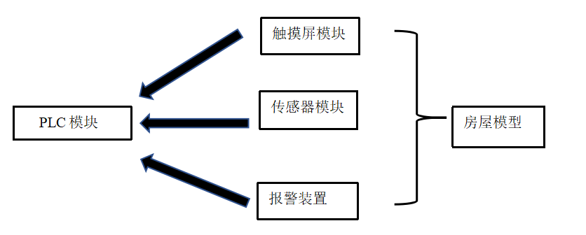

# Intelligent-Home-Anti-theft-System
---
> 摘要:
> 自从世界上第1幢智能建筑1984年在美国出现后，美国、加拿大、欧洲、等经济比较发达的国家先后提出了各种智能家居的方案。目前国内智能家居主要的市场还是一些高端市场：别墅（零售、工程）、智能小区（工程），但是普通住宅智能家居（零售）市场却发展很慢。对于普通百姓，智能家居的复杂功能带来高昂的使用费用，如何降低成本，是未来智能家居系统的主要方向，在此背景下，我们利用施耐德电气平台和简单的传感器（压力传感器，光电传感器，温度传感器等）模拟实现智能家居防盗系统，运用触摸屏这种简易的人机交互界面来进行信息输送，性价比高，易于实现，设备可塑性强，可拓展性高，实现了防盗报警，高温报警等安全隐患预防的功能。
##### 关键词：施耐德电气平台;  PLC; Vijeo+Citect+SCADA
---
> ABSTRACT:
> Since the world's first intelligent building appeared in the United States in 1984, the United States, Canada, Europe, and other developed countries have proposed various smart home solutions. Currently, the main market for smart homes in China is still some high-end markets: villas ( Retail, engineering), intelligent community (engineering), but the ordinary residential smart home (retail) market has developed very slowly. For ordinary people, the complex functions of smart homes bring high cost of use, and how to reduce costs is the main direction of smart home systems in the future. In this context, we use Schneider Electric platform and simple sensors (pressure sensors, photoelectric sensors, Temperature sensor, etc.)to simulate the realization of smart home anti-theft system, using touch screen such simple human-computer interaction interface for information transmission It’s cost-effective, easy to implement, equipment plasticity, high expandability. Ultimately, we realize anti-theft alarm, high temperature alarm and the system has a good performance of hidden danger prevention.
##### KEYWORDS:Schneider Electric platform; PLC; Vijeo+Citect+SCADA.
---
### 引导
#### 1. 概述
#### 2. 系统总体说明
#### 3. 系统的硬件结构
#### 4. 系统的软件结构
#### 5. 系统功能测试
#### 6. 系统使用方法
#### 7. 展望
#### 8. 致谢
#### 9. 参考资料
#### 10. 附录
---
#### 1. 概述
##### 1.1编写说明
本文档系2018-2019学年秋季学期工程实践与科技创新IIIB课程第四小组设计报告。本设计报告展示了我组基于施耐德M340系列PLC设计的课程项目“智能家居防盗系统”的设计初衷、期望目标、软硬件结构、设计和实践的过程以及最终实际完成效果。本报告的撰写旨在使读者快速对“智能家居防盗系统”的设计思路、控制原理等方面获得整体上的了解。	
##### 1.2名词定义
①可编程逻辑控制器：可编程逻辑控制器是种专门为在工业环境下应用而设计的数字运算操作电子系统。它采用一种可编程的存储器，在其内部存储执行逻辑运算、顺序控制、定时、计数和算术运算等操作的指令，通过数字式或模拟式的输入输出来控制各种类型的机械设备或生产过程。

②M340：ModiconM340是全球能效管理专家施耐德电气于2007年推出的高性能中型PLC平台，从属于Unity软件平台。

③Modbus：一种串行通信协议，目前是工业系统中电子设备之间的常用连接方式。

④传感器：一种检测装置，能感受到被测量的信息，并能将感受到的信息，按一定规律变换成为电信号或其他所需形式的信息输出，以满足信息的传输、处理、存储、显示、记录和控制等要求。

⑤执行器：执行器是自动控制系统中必不可少的一个重要组成部分。它的作用是接受控制器送来的控制信号，改变被控介质的大小，从而将被控变量维持在所要求的数值上或一定的范围内。

⑥触摸屏：触摸屏（touch screen）又称为“触控屏”、“触控面板”，是一种可接收触头等输入讯号的感应式液晶显示装置，当接触了屏幕上的图形按钮时，屏幕上的触觉反馈系统可根据预先编程的程式驱动各种连结装置，可用以取代机械式的按钮面板。
##### 1.3缩略语
①PLC (Programmable Logical Controller)：可编程逻辑控制器；

②CPU (Central Processing Unit)：中央处理器；

③USB (Universal Serial Bus) ：通用串行总线；

④I/O (Input/Output) ：输入/输出；

⑤TCP (Transmission Control Protocol) ：传输控制协议；

---
#### 2.系统总体说明
##### 2.1系统设计要求
整个智能家居防盗系统共三道防护措施，分别是密码锁，光电传感器和温度传感器。密码输入错误，光电门检测到非法闯入和温度传感器温升超过一定阈值均会触发报警系统，其中密码锁只影响光电门的报警，不影响温度传感器的报警。特殊情况下，在获得授权后，门卫可以关闭报警系统，人员可以正常进入，但门卫也可以一键报警。另外增加火灾报警，温度超过一定较高限度即触发警报。
##### 2.2系统实际完成的功能
**1.密码锁**
（1）在密码输入正确或在密码输入错误两次以内输入正确后，光电门报警系统关闭，人员可进入，灯光和排气扇打开。
（2）在密码输入错误后系统会被锁定一段时间，不能输入密码，且锁定时间随着错误次数的增加而延长。在错误三次之后，报警系统报警，且不会自动关闭。
（3）在门卫关闭报警系统之后，密码锁被绕过，直接进入。

**2.光电传感器**
（1）在密码锁输入正确之后或者门卫关闭报警系统之后，光电门失效。
（2）正常情况下，光电门处于开启状态，在有人员通过时会发出警报。

**3.温度传感器**
温度传感器的报警始终处于开启状态，除非门卫关闭报警系统。
（1）温度传感器做防盗用。阈值设置较低，用来检测人体，防止重要物体被搬动。
（2）温度传感器做防火用。阈值设置较高，用来检测局部高温，防止产生火灾。

**4.其他功能**
（1）关门：灯光和排气扇关闭，报警系统重新开启。
（2）重启：系统可通过重启返回初始化状态。
（3）人性化交互：密码锁界面提示输入正确或错误及次数；显示当前时间。

##### 2.3系统的设计原理概述
整个系统的硬件部分包括组态，触摸屏，PLC控制器和传感器，以及其他组件。其中PLC控制器是系统的核心组件，其接收来自传感器和触摸屏或者组态的状态信息：是否非法闯入，温度是否过高以及密码输入是否正确。并以此为依据调整系统的状态：发出/关闭警报，打开/关闭灯光和排气扇。触摸屏和组态的作用相似，用来输入控制信息：键入密码，重启系统和关门操作。光电传感器用来检测是否有人员通过并发出信号给PLC，温度传感器检测温升是否超过阈值并发送信号给PLC。

---
#### 3.系统的硬件结构
##### 3.1硬件总体结构

**总体结构：**
①触摸屏模块、传感器模块、报警装置各自与PLC通过导线电路连接；

②传感器模块、报警装置与房屋模型进行物理连接。
